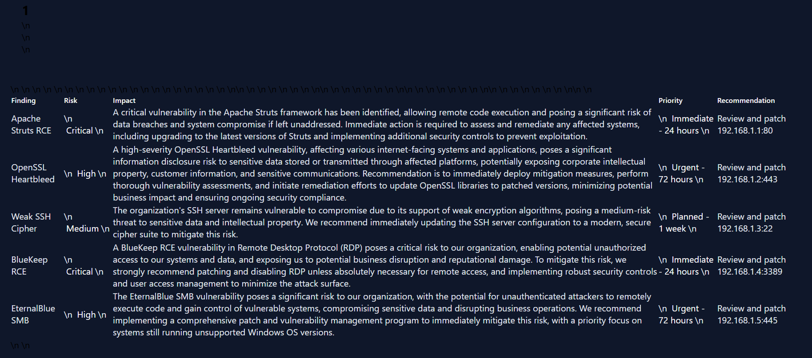
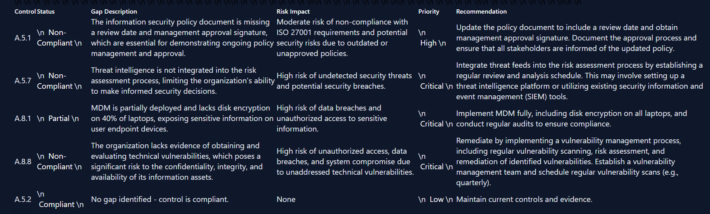
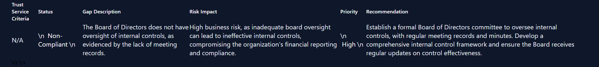

# AI Cybersecurity Reports

AI-powered automation for cybersecurity GRC reporting. Built in public.

## 🚀 Products

### 1. Vulnerability Report Generator
- **Input:** Raw vulnerability scan data (CSV, Nessus, Qualys)
- **Output:** Professional HTML executive summary
- **Features:**
  - AI-generated impact summaries (Groq API - llama-3.1-8b-instant)
  - Color-coded risk levels (Critical/High/Medium/Low)
  - Auto-prioritized remediation timeline
  - Business impact assessment per finding
  - Estimated remediation cost range
  - Total portfolio remediation cost
- **Live Demo:** [View Sample Report](Vulnerability%20Scan%20Executive%20Summary.html)
- **Hire Me:** [Fiverr Gig](https://www.fiverr.com/s/GzVdL50)

### 2. ISO 27001 Compliance Gap Analyzer
- **Input:** ISO 27001 controls + client evidence
- **Output:** Structured gap report with remediation steps
- **Features:**
  - Gap identification (Compliant/Partial/Non-Compliant)
  - Risk impact assessment
  - Priority + timeline recommendations
- **Live Demo:** [View Sample Report](ISO%2027001%20Compliance%20Gap%20Analysis.html)

### 3. SOC 2 Compliance Gap Analyzer
- **Input:** SOC 2 Trust Service Criteria + client evidence
- **Output:** Audit-ready gap report
- **Features:**
  - Criteria matching and gap analysis
  - AI-generated gap descriptions
  - Remediation recommendations
- **Live Demo:** [View Sample Report](SOC%202%20Gap%20Analysis%20report%20.html)

## 🎥 Video Demos
- [Vulnerability Report Demo](https://www.loom.com/share/5dc8a929366e45f0852c58e12b7bc6cc)
- [Compliance Gap Analyzer Demo](https://www.loom.com/share/09d4a83d1b33467bafc1efffc5b314d3)

## 🛠 Tech Stack
- [n8n](https://n8n.io/) — workflow automation
- [Groq API](https://groq.com/) — llama-3.1-8b-instant
- HTML/CSS — report generation

## 📊 Sample Reports

| Report | Screenshot |
|---|---|
| Vulnerability Report (with cost analysis) |  |
| ISO 27001 Gap Report |  |
| SOC 2 Gap Report |  |

## 📁 Workflows

All n8n workflows are in the `/workflows` folder:
- `Vulnerability Scan Executive Summary.json`
- `ISO 27001 Compliance Gap Analysis.json`
- `SOC 2 Gap Analysis Report.json`

## 🏗 Building in Public

- Day 0: Started building
- Day 2: Vulnerability report generator working
- Day 4: Compliance gap analyzer built
- Day 5: Professional HTML report output
- Day 6: Cost analysis + business impact added
- Day 7-8: Three-product suite complete

**Status:** Zero clients. Zero revenue. But the product works.

## 🤝 Connect
- [LinkedIn](https://linkedin.com/in/kartik-sharma-b34a41422)
- [Fiverr](https://www.fiverr.com/s/GzVdL50)

---

Built by Kartik Sharma | Final year Cybersecurity, Shoolini University
